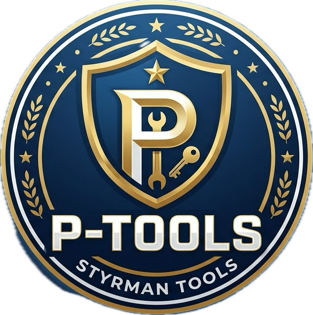

<p align="center">
	
</p>

<h1 align="center">P-Tools v1.0.0</h1>

P-Tools is a simple desktop utility built with Python and Tkinter. It brings several practical tools together in one interface.

## Features

- **RIPE Search** - retrieve network information, AS numbers, ownership, reverse DNS and country data for an IP address.
- **Phone Numbers** - validate phone numbers and display timezone, location and service provider information.
- **Media Converter** - convert video and audio files to formats such as MP4, MP3, AVI, MKV and WAV.
- **Conversion status** - track progress with a progress bar and cancel an active conversion.
- **About** - view the project version and license information.

The IMEI feature is prepared in the interface but is not enabled yet.

## Requirements

- Python 3.10 or later
- FFmpeg installed and available in the system `PATH`
- The Python packages listed in `requirements.txt`

## Installation

Clone the project and open the project directory:

```bash
git clone https://github.com/styrman-g/P-Tools.git
cd P-Tools
```

Create and activate a virtual environment:

```bash
python3 -m venv .venv
source .venv/bin/activate
```

Install the project's Python dependencies:

```bash
pip install -r requirements.txt
```

Install FFmpeg according to the instructions for your operating system. Verify the installation with:

```bash
ffmpeg -version
```

## Run the application

Run the application from the project's `src` directory because it uses relative paths for the icons:

```bash
cd src
python3 main.py
```

## Create a Windows release

The repository includes a GitHub Actions workflow that builds a Windows `.exe` with PyInstaller and attaches it to a GitHub Release. The workflow also bundles FFmpeg with the application.

To create a release, push a version tag:

```bash
git tag v1.0.0
git push origin v1.0.0
```

The workflow runs on tags beginning with `v` and publishes `P-Tools.exe` automatically. You can also start the workflow manually from the **Actions** tab in GitHub.

## Usage

Select a tool from the sidebar and provide the requested information.

For media conversion:

1. Click **Browse** and select an audio or video file.
2. Select the desired output format.
3. Click **CONVERT**.
4. Use **CANCEL** if the conversion needs to be stopped.

The converted file is saved in the same directory as the original file.

## Project structure

```text
P-Tools/
├── README.md
├── LICENSE
├── requirements.txt
└── src/
	├── main.py       # Tkinter interface
	├── converter.py  # Media conversion via FFmpeg
	├── ripe.py       # RIPE API requests
	├── phone.py      # Phone number lookup
	└── icons/        # Icons and logo
```

## License

See [LICENSE](LICENSE) for the project's license terms.

## 🚀 Download

Download the latest version of P-Tools for Windows without installing Python:

👉 **[Download P-Tools v1.0.0 (.exe)](https://github.com/styrman-g/P-Tools/releases/download/v1.0.0/P-Tools.exe)**
